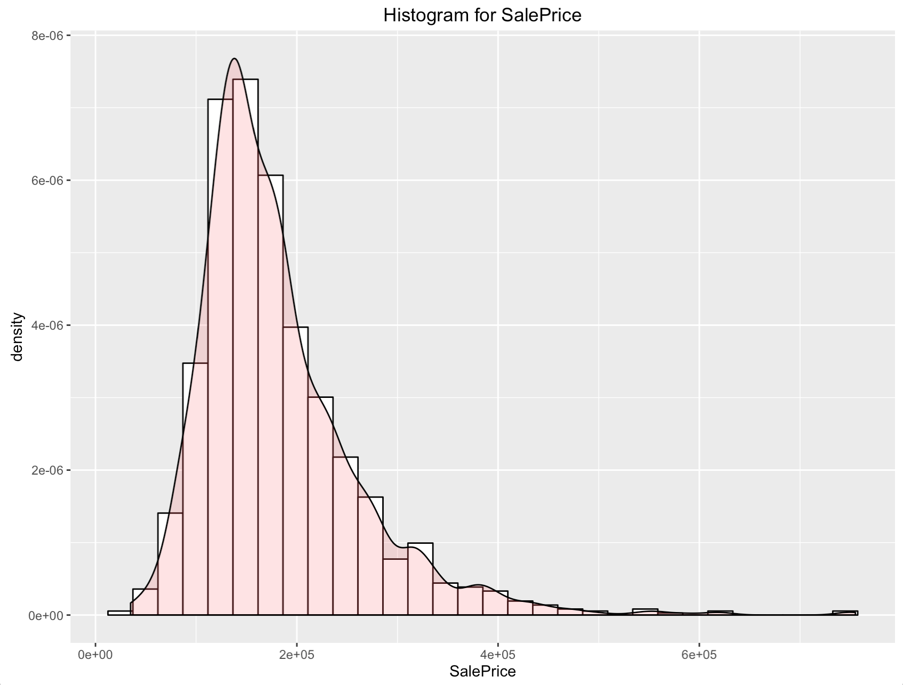
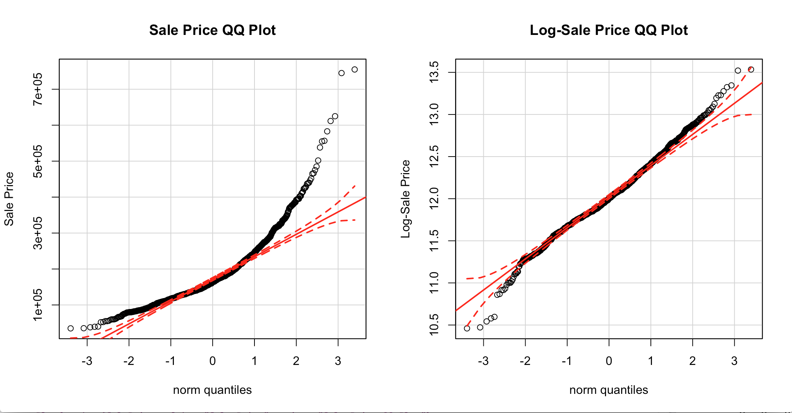
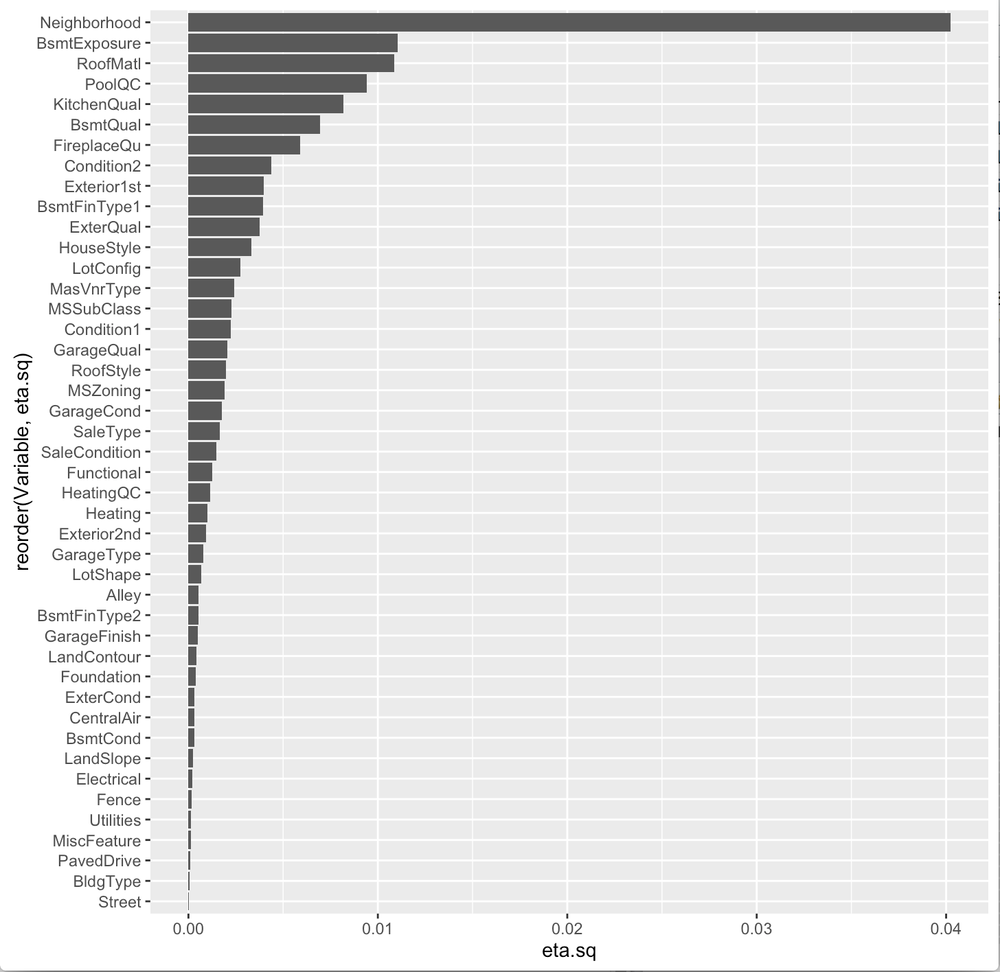
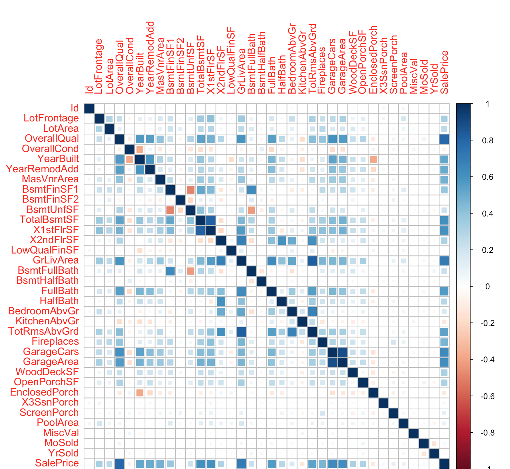
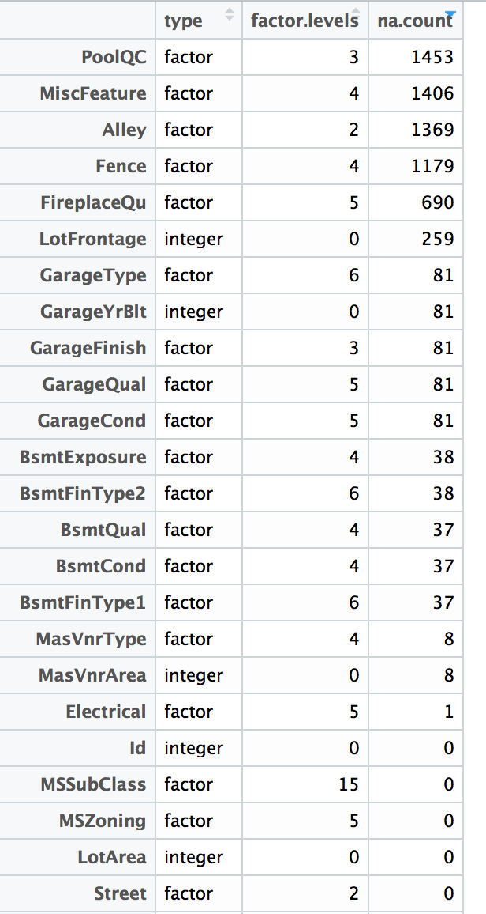
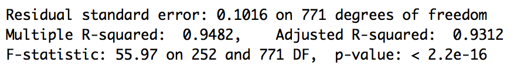

# Perform Data Analysis
> What were top 3-5 observations (describe w/ screenshots)?

* Distribution of sale prices appears to be skewed and benefits from log transformation.

* Among categorical features, an eta-squared analysis of feature effect shows Neighborhood will have the strongest effect of home pricing.

* Many apparently minor features showed outsized effect in the eta-squared analysis above- examples include Basement Exposure (#2 importance) and Roofing Material (#3 importance). It is possible that these features are either proxies for other features (i.e. home style) or susceptible for overfitting (i.e. a few luxury homes using a niche roof material). These features should be carefully examined during training, perhaps using cross-validation methods to investigate possible overfitting.

* Correlation plotting shows co-linearity between some numeric variables, providing opportunities for feature elimination. Examples included YearBuilt:YearRemodAdd, TotalBasementSqFt:1stFloorSqFt, and GarageCars:GarageArea.

* The correlation analysis shows that the price of a home is generally driven by size and quality of the construction.

# What features appear most promising for modeling?
> Describe how features were selected, including screenshots if appropriate

Feature filtering was approached using a combination of correlation plots (for numerical features) and eta-squared (for categorical features).

* Among numerical features, a correlation plot shows strong predictive potential from OverallQual, YearBuilt, 1stFloorSqFt, GrLivArea, FullBath, TotRmsAbvGrd, Fireplaces and GarageCars.

* Due to co-linearity, it appears that YearRemodAdd, TotalBasementSqFt, and GarageArea can be removed due to strong correlation with other features.

* Among categorical features, Neighborhood appears to be a very strong predictor of price, as expected from experience purchasing a home. Expanding the list of features with relatively strong eta-square results are BsmtExposure, RoofMatl, PoolQC, KitchenQual, BsmtQual, FireplaceQu, Condition2, Exterior1st, BsmtFinType1, ExterQual, HouseStyle and LotConfig. As mentioned in the observations section, some of these features are suspect and may lead to overfitting.

* Id is clearly an administrative column and removed due to lack of information for modeling.

# Data tidying
> Deal with missing values?
> Scale the attributes?

### Missing values
Initial evaluation of missing values produced the following table, showing the number of NA rows by feature, in descending order:

Missing data were handled differently based on the feature. In the first cohort, NAs were simply re-labeled as "None":
* PoolQC
* MiscFeature
* Alley
* Fence
* FireplaceQu
* GarageFinish
* GarageQual
* GarageCond
* GarageType
* BsmtExposure
* BsmtFinType2
* BsmtQual
* BsmtCond
* BsmtFinType1
* MasVnrArea
* MasVnrType

Imputed values using means for the following:
* LotFrontage
* Electrical

Dropped features:
* GarageYrBlt

### Scaling
There are obvious needs to scale the features if a distance-based modeling method (i.e. SVM) is used- we see scales with multiple orders of magnitude in difference as we compare number of beds/baths (1s) to square footage (100s to 1000s) to sale prices (100000s).

# Make initial modeling attempt to set baseline

A simple linear model was constructed to model the log-transformed Sale Price, with no feature engineering beyond missing value handling described above.

The model was trained on a training dataset comprised of 70% of the "train.csv" dataset. This linear model achieved an adjusted-R^2 score of 0.9312. Evaluating against the remaining 30% holdout produced an RMSE of 0.12016- good enough for a top 250 result on the current leaderboard if similar performance is maintained with the test set.

